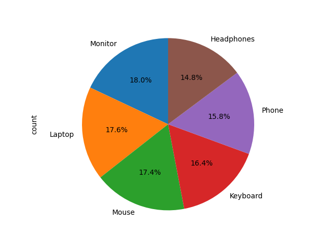

# 📊 E-Commerce Sales Analyzer

An interactive dashboard to explore and analyze e-commerce sales data using **Python**, **Streamlit**, **Pandas**, and **Plotly**.

---

## 🔍 Key Features

- 📦 Product-wise sales distribution (Pie chart)
- 📅 Monthly sales trend (Bar chart)
- 🧠 Top 5 products by total sales
- 📈 Monthly average sales per product (Line chart)
- 🔎 Sidebar filters by product
- 🧾 Download filtered data as CSV
- 🗂️ User filter actions are saved in `user_logs.csv`

---

## 📷 Visual Insights

### Product Sales Distribution


> (Other charts are dynamically generated in the app)

---

## 🚀 How to Run

1. **Clone this repo**

```bash
git clone https://github.com/taqi-jpg/ecommerce-sales-analyzer.git
cd ecommerce-sales-analyzer
