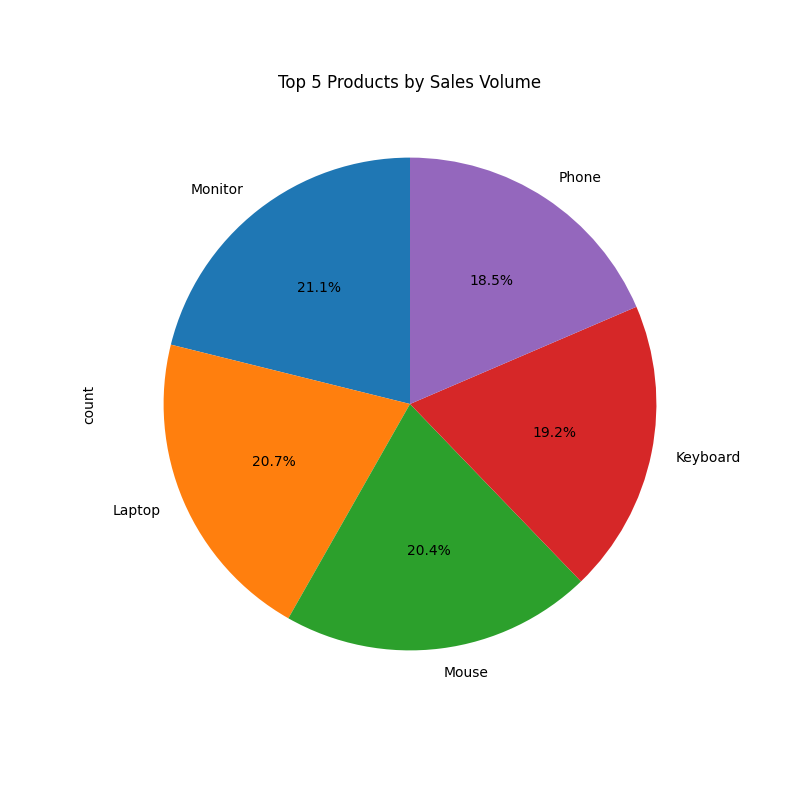

# 📊 E-Commerce Sales Analyzer  
Automated sales analysis with Python.  

## 🔍 Insights  
  
  

## 🚀 How to Run  
1. Clone this repo:  
   ```bash
   git clone https://github.com/taqi-jpg/ecommerce-sales-analyzer.git


---

### **💡 Troubleshooting**  
- **Error: "File not found"?**  
  - Ensure the `data/` and `assets/` folders exist.  
  - Run the script from the **project root folder** (where `sales_analyzer.py` is located).  

- **Charts not saving?**  
  - Add this at the start of your script:  
    ```python
    os.makedirs("assets", exist_ok=True)
    ```

---

### **🎉 What’s Next?**  
1. **Add forecasting** (ARIMA/Prophet) → Predict future sales.  
2. **Build a Streamlit dashboard** → Interactive web app.  
3. **Deploy to GitHub Pages** → Share your report online.  

